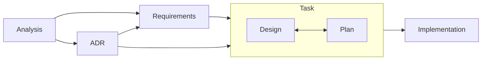

# AGENTS.md

## User Interaction Policy
- Please respond to all explanations, comments, and review results in Japanese.
- Code and log text itself may remain in English.

## Documentation Language Policy

All documentation output in this project must be written in Japanese, including:

- Code comments
- Commit messages
- Architecture Decision Records (ADRs)
- README files
- API documentation
- Error messages
- User-facing documentation
- Test descriptions
- TODO comments
- Any other written documentation

## Project Overview

This repository hosts a Java-based LangChain4j/Claude skills agent and supporting templates for the Traceable Development Lifecycle (TDL). TDL materials were originally authored for the Kopi project (Apache License 2.0); original rights remain with the Kopi authors and are acknowledged here.

## Agent Operating Environment

### Planning and Tooling Discipline

- Use the planning tool for any task that is not trivially simple; plans must include at least two steps and be updated as work progresses. Skip planning only for the simplest \~25% of tasks.
- At the start of each session, run `serena__activate_project` to bind Serena to the current repository context.
- After activation, run `serena__check_onboarding_performed`; if it indicates onboarding is incomplete, execute `serena__onboarding` before proceeding.
- At the start of each task, run `bun scripts/trace-status.ts --write` to regenerate `docs/traceability.md` and identify any traceability gaps before continuing.
- Before insert/replace/delete edits, invoke `serena__think_about_task_adherence`; after gathering significant context, call `serena__think_about_collected_information` to confirm understanding.
- Follow the Traceable Development Lifecycle (TDL) for non-trivial work and ensure traceability artifacts stay in sync.

### Approvals and Safety

- Exercise caution with destructive operations (`rm`, `git reset`, etc.); seek explicit user direction before proceeding.
- If unexpected repository changes appear, pause and confirm next steps with the user.

## Developer Principles

### Resource Safety Over Micro-optimization

- Prioritize correctness and predictable behavior over micro-optimizations.
- Use clear ownership of resources: rely on `try-with-resources`/closeable patterns for anything that needs closing.
- Avoid global/static state unless justified; prefer explicit dependency injection, instance fields, or method-local variables.
- Accept reasonable overhead if it simplifies reasoning and prevents leaks or concurrency pitfalls.

### Code Clarity

- Write clear, readable code that is easy to understand and maintain
- Use descriptive variable, class, and method names; avoid abbreviations that hide intent
- Add comments for complex logic, but prefer self-documenting code
- Structure code to minimize cognitive load for future developers

### Clean Code Maintenance

- Remove unused variables, parameters, and class members promptly
- When refactoring, trace through all callers to eliminate unnecessary parameters
- Keep data classes lean by removing fields that are no longer used
- Use static analysis and linting configured for the project (e.g., Gradle `check`, SpotBugs/Checkstyle) to surface issues early
- Example: If a function parameter like `arch` is no longer used in the implementation, remove it from the function signature and update all callers

### Prefer Functions Over Classes Without State

- When there's no state to manage, prefer implementing functionality as static functions in well-named classes rather than creating empty shells
- Only create classes when you need to maintain state, implement interfaces, or group related data
- This keeps the code simpler and more straightforward
- Example: For utility operations like file validation or string parsing, use static methods in a clearly named class instead of a stateful object

### External API Testing

- When writing code that calls external Web APIs, implement at least one unit test that includes the actual JSON response obtained from calling the API (captured via curl or similar)
- Store the JSON response as a string within the test code or fixtures.
- This ensures that the parsing logic is tested against real API responses
- Example:

```java
@Test
void parsesFoojayApiResponse() {
    // JSON response obtained from: curl https://api.foojay.io/disco/v3.0/packages?version=21
    String json = """
        {"result":[{"id":"abcd1234","distribution":"temurin","major_version":21}]}
        """;

    ObjectMapper mapper = new ObjectMapper();
    JsonNode root = mapper.readTree(json);
    assertEquals("temurin", root.get("result").get(0).get("distribution").asText());
}
```

### Avoid Generic "Manager" Naming

- When the name "manager" appears in file names, classes, interfaces, or similar constructs, consider more specific and descriptive alternatives
- "Manager" is often too abstract and doesn't clearly communicate the responsibility
- Choose names that describe what the component actually does
- Examples of better alternatives:
  - `FileManager` → `FileSystem`, `FileStore`, `FileRepository`
  - `ConnectionManager` → `ConnectionPool`, `ConnectionFactory`
  - `TaskManager` → `TaskScheduler`, `TaskExecutor`, `TaskQueue`
  - `ShimManager` → `ShimInstaller`, `ShimRegistry`, `ShimProvisioner`
- This principle helps maintain code clarity and makes the codebase more intuitive

### Avoid Vague "Util" or "Utils" Naming

- In Java, utility classes with static methods are acceptable when their responsibility is clear (e.g., `FileUtils`, `StringUtils`).
- Avoid generic catch-all utility classes; organize by focused responsibility instead.
- Choose names that clearly describe what utilities the class provides.
- Examples of better organization:
  - `com.example.util.string` → `com.example.text.StringValidator` or `com.example.text.TextFormatter`
  - Focused `FileUtils` is acceptable; refactor only if it handles multiple unrelated concerns
  - `DateUtil` → `DateFormatter` or `DateTimeParser` when single-purpose
  - `CommonUtils` → Split into `ValidationUtils`, `ConversionUtils`, etc. by domain
  - `utilFunction()` → Rename to `validateInput()`, `formatOutput()` to reflect actual behavior
- Even utility classes should have clear purpose; good naming makes them easy to locate and understand

### Module Placement Consistency

- Consult `docs/architecture.md` before creating or moving modules so directory structure stays aligned with the documented layout.
- Keep platform-dependent code under appropriate platform-specific packages and expose only cross-platform interfaces from higher layers.
- When introducing new components, document their location rationale in the relevant design or plan to aid future maintainers.

### Prevent Circular Module Dependencies

- Keep the module graph acyclic so features remain testable and maintainable.
- Favor dependency inversion (interfaces) or data transfer structures instead of bidirectional imports when modules must collaborate.
- If a new dependency would close a cycle, refactor by extracting shared functionality into a dedicated module documented in the architecture references.
- Run dependency analysis tools or targeted checks when restructuring to confirm cycles are not introduced.

## Traceable Development Lifecycle (TDL)

_Structured phases, linked artifacts, verifiable outcomes_

This project follows the Traceable Development Lifecycle (TDL), a structured development process with full traceability from discovery through delivery. Consult the primary references when in doubt:

**[`docs/tdl.md`](docs/tdl.md)** - Full TDL documentation and workflow\
**[`docs/templates/README.md`](docs/templates/README.md)** - Template descriptions and usage instructions

### TDL Process Overview



### Key Locations

- **Templates**: `docs/templates/` - All document templates
- **Analysis**: `docs/analysis/AN-<id>-<topic>.md` - Problem exploration
- **Requirements**: `docs/requirements/FR-<id>-<capability>.md` and `NFR-<id>-<quality>.md` - Formal requirements
- **ADRs**: `docs/adr/ADR-<id>-<title>.md` - Architecture decisions (current format)
- **Tasks**: `docs/tasks/T-<id>-<task>/` - Design and plan documents (current format)
- **Traceability**: `docs/traceability.md` - Central mapping matrix

### Document Workflow & Approvals

**Cross-Stage Governance**

- **Approval Rules**
  - **Stage Separation**: Complete only one stage per approval cycle; never advance without an explicit “go”.
  - **Clarity Guardrail**: Treat ambiguous instructions as cues to request confirmation.
  - **Status Maintenance**: Keep document metadata current so reviewers know the active phase.

- **Exception Handling**
  - **Immediate Pause**: If work advanced without the required approval—or a prerequisite artifact is missing—stop immediately.
  - **User Decision**: Ask whether to delete the premature work and restart or treat it as a draft for sequential review.
  - **Upstream Gap**: When a needed analysis, requirement, or ADR is absent, suspend implementation, create the missing document via templates, secure approval, and only then resume coding.

**Stage-by-Stage Flow**

1. **Analysis (`docs/analysis/AN-…`)**
   - **Deliverable**: Problem statement with context, alternatives, and recommendation.
   - **Approval Gate**: Share the draft and wait for explicit approval before drafting requirements.

2. **Requirements (`docs/requirements/FR-…` / `NFR-…`)**
   - **Deliverable**: Verifiable functional and non-functional requirements derived from the approved analysis.
   - **Approval Gate**: Present the requirements and wait for explicit approval before writing the ADR.

3. **Architecture Decision (`docs/adr/ADR-…`)**
   - **Deliverable**: Decision record describing the structural approach that satisfies the requirements.
   - **Approval Gate**: Submit the ADR and wait for explicit approval before creating the task package.

4. **Task Package (`docs/tasks/T-…/`)**
   - **Deliverable**: Task directory with `design.md`, `plan.md`, and an updated `README.md` linked to upstream artifacts.
   - **Approval Gate**: Share the task documents and wait for explicit approval before starting implementation.

5. **Implementation**
   - **Deliverable**: Code and supporting assets tied to the approved task.
   - **Approval Gate**:
     - Treat every phase listed in `plan.md` as its own approval checkpoint.
     - After finishing a phase, immediately stop, mark the corresponding checklist item as `[x]`, and request explicit approval to proceed.
     - Do not write code, run tests, or change artefacts for the next phase until that approval is received.
     - If approval is missing or unclear at any point, halt all implementation work and ask the approver how to proceed; the only permitted actions while waiting are housekeeping required to request approval (e.g., summarising work done or reverting unintended edits).

## Development Workflow

### Completing Work

#### Java Code

When finishing any Java coding task, run the following commands in order and fix any issues:

1. `./gradlew check` - Format/lint/static analysis as configured
2. `./gradlew test` - Run unit/integration tests
3. `./gradlew build` - Verify packaging/build

Address any errors from each command before proceeding to the next. All must pass successfully before considering the work complete.

#### Markdown Documentation

When working on Markdown documentation (`.md` files), run the following commands:

1. `bun format` - Auto-format markdown files
   - Automatically fixes formatting issues
   - Ensures consistent markdown style across all documentation

2. `bun lint` - Check markdown linting
   - Identifies potential issues and violations
   - Common issues: trailing spaces, inconsistent indentation, missing blank lines
   - Fix any warnings or errors reported

Both commands must pass successfully before considering the documentation work complete. After the document is finalized, compare it against the source template (for example, `docs/templates/analysis.md`) to confirm the Metadata, Links, and status selections remain consistent with the current standards.

#### TypeScript Code

When editing any TypeScript files, run each of the following commands and resolve any reported errors before moving on:

1. `bun format:ts` - Format TypeScript sources
2. `bun lint:ts` - Lint TypeScript code with project rules
3. `AGENT=1 bun test:ts` - Execute the TypeScript test suite

All three commands must complete without errors to finish TypeScript-related work.

### Documentation Updates

- Ensure documentation, comments, and messages remain in Japanese.
- For Markdown changes, run `bun format` followed by `bun lint` and resolve any reported issues before finalizing.
- If `docs/traceability.md` is missing or you add or remove any files under `docs/`, run `bun scripts/trace-status.ts --write` to regenerate the traceability matrix before completing the work.
- During implementation, mark the completed phase checkboxes in the relevant documents at the end of each phase so progress stays transparent and auditable.

## Essential Commands

- **Check/Lint**: `./gradlew check` (or module equivalent)
- **Test**: `./gradlew test`
- **Build**: `./gradlew build`

## Additional Documentation

- **Architecture & Structure**: [`docs/architecture.md`](docs/architecture.md) - Project structure, components, and storage locations
- **Error Handling**: [`docs/error_handling.md`](docs/error_handling.md) - Error types, exit codes, and context system

## Communication Guidelines

- Default to concise, friendly teammate tone; structure responses for quick scanning without over-formatting.
- Lead code-change summaries with the key outcome, then reference affected paths with `path:line` format (no ranges).
- Use bullets (`-`) for lists, avoid nested bullets, and reserve headings for major sections only when helpful.
- Include suggested next steps (tests, commits, verification) when they naturally follow from the work performed.
- Do not paste entire file contents; reference file paths instead.
- When the user requests command output, summarize relevant lines rather than dumping full logs.
- Execute simple user requests via shell commands when appropriate (e.g., `date`), respecting the environment rules above.
